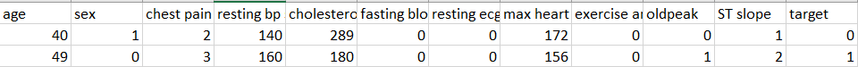

# Heart-disease-prediction-using-ML
Aim : Machine Learning app for predicting Heart chances of Heart disease and giving Remedies according to the condition of the heart  
Dataset Link : https://ieee-dataport.org/open-access/heart-disease-dataset-comprehensive#files  

<b><h3>This ML model is build on a dataset and will predict 94% true results but we still request you to have a consultation with the doctor </h3></b>
<b> For input values you can also refer to the Documentation PDF in the dame folder</b>

Steps to Install Streamlit :
pip install streamlit
  

For running the code :
streamlit run app.py ( open CMD in the same directory as the file ) 

No. of rows : 1190  
No. of columns : 0-11 as x and 12th as output  

<b><h2>Training and testing of data<h2></b>
<h3>Training : 952 points</h3>
<h3>Testing : 238 points</h3>
<b> It follows 80:20 Ratio</b>

<b><h2>Inputs and outputs<h2></b>
<h3>The below data is of two patients in which if the Target value is 0 then no chances of heart disease and if 1 then positive chances .</h3> 
<b>Inputs: </b>age,	sex,chest-pain, type,	resting bps,	cholesterol,	fasting blood-sugar,	resting ecg,	max heart-rate,	exercise-angina,	oldpeak,	ST slope  
<b>Outputs: </b> target 

</img>
<!-- <li>For Sex ,it is 1 for male and 0 for female</li>  -->

<b><h2>Algorithms used</h2></b>
<li>Logistic Regression : got 84% accuracy</li>
<li>KNN Classifiers     : got 66% accuracy</li>
<li>Decision Tree       : got 90% accuracy</li>
<li>Random Forest       : got 94% accuracy</li>

<b> As using the Random forest we got the highest accuracy ,we had used this trained model in our web app </b>

  <h2><b>I hope you like our application, do give it a try and raise a issue if anything is not proper </b></h2>

  <b><h3>Made with efforts by Shaima and Shubham as a part of MLDLS 2021 project </h3></b>

